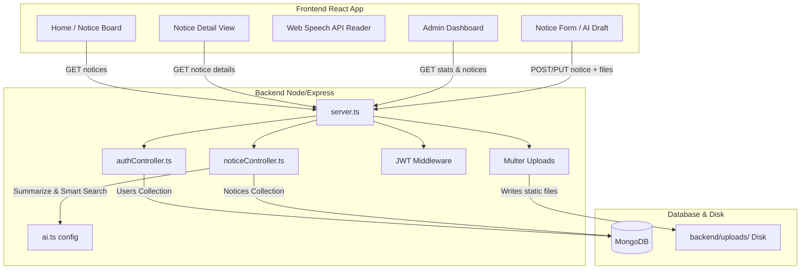

# Campus Digital Noticeboard System

Welcome to the **Digital Noticeboard System**! This is a modern, full-stack (MERN) web application designed to replace traditional paper campus bulletins with a responsive, high-impact digital interface. It includes administrative control dashboards, PDF/image attachment managers, dark/light theme options, and advanced AI integrations.

---

## 🛠️ Architecture & Technology Stack

The project is structured into two main packages managed by a root orchestrator:
*   **Frontend**: React (Vite) + TypeScript + Tailwind CSS.
*   **Backend**: Node.js + Express + TypeScript.
*   **Database**: MongoDB (Mongoose Object Data Modeling).
*   **AI Engine**: Official Google Gen AI SDK (`@google/genai` with Gemini 2.5 Flash).



---

## 🚀 Fast Start & Setup Guide

### Prerequisites
1.  **Node.js** (v18 or higher recommended).
2.  **MongoDB** running locally. (If you don't have MongoDB installed, you can download MongoDB Community Server or use a free database instance on MongoDB Atlas).

### Installation
From the root project directory (`Digital Noticeboard`), run:
```bash
npm run install:all
```
This single script installs dependencies for the root coordinator, backend server, and frontend client.

### Environment Configuration
1.  Go to the `backend/` directory and copy the template file `.env.example` to create `.env`:
    ```bash
    cp .env.example .env
    ```
2.  Open the newly created `.env` file and configure your keys:
    *   **PORT**: The port the backend server listens on (defaults to `5000`).
    *   **MONGODB_URI**: Your database connection string. You can use a local database link or a cloud link from your **MongoDB Atlas** account (e.g., `mongodb+srv://...`).
    *   **JWT_SECRET**: A secure random secret key used to sign admin session tokens.
    *   **GEMINI_API_KEY**: To enable smart AI features, generate a free key at [Google AI Studio](https://aistudio.google.com/) and paste it here. If left empty, the application will automatically fall back to local text cutters and keyword search algorithms.

### Running the Project Locally
To boot both the backend API and frontend dev server simultaneously, run this command from the root directory:
```bash
npm run dev
```
*   **Frontend Client**: [http://localhost:5173](http://localhost:5173)
*   **Backend API**: [http://localhost:5000](http://localhost:5000)
*   **Default Admin Credentials**: Username: `admin` | Password: `admin123` *(Seeded automatically on backend boot)*

---

## 🎓 Concept Tutorials: How Things Work

Here are step-by-step explanations of the core programming concepts implemented in this codebase:

### 1. Model-View-Controller (MVC) Design Pattern
Our Express backend is structured using MVC principles:
*   **Models (`backend/src/models/`)**: Define the data structure (schemas) stored in MongoDB. We have `User.ts` (Admin info) and `Notice.ts` (Titles, categories, expiry, and attachments).
*   **Controllers (`backend/src/controllers/`)**: House the actual logical functions (e.g., how to search notices, how to save notices, how to login).
*   **Routes (`backend/src/routes/`)**: Map web request URLs (endpoints like `/api/notices`) to their corresponding controller functions.

### 2. Secure JWT Authentication
How does the administrator log in securely without keeping constant connections open?
1.  **Hashing**: When the server seeds the database, it hashes the plain password `admin123` into an unreadable string using **Bcrypt**.
2.  **Verification**: When the admin enters credentials on the login page, the server uses Bcrypt to compare the input password with the hashed password in MongoDB.
3.  **Token Issuance**: If the password matches, the server generates a **JSON Web Token (JWT)** containing the user's ID and role, signed with a secret key (`JWT_SECRET`).
4.  **Middleware Guard**: Administrative endpoints (like posting or deleting a notice) are protected by a middleware function (`authenticateJWT`). This function checks the incoming request headers for a `Bearer <token>` string, verifies it, and rejects the request with a `401 Unauthorized` status if the token is missing or expired.

### 3. File Attachments & Dual-Action Downloads
HTML forms send standard text inputs, but uploading files requires sending data as `multipart/form-data`.
*   **Multer** is a middleware that intercepts these requests, extracts file buffers (images/PDFs), generates a unique filename, and writes the file directly to the backend disk (`backend/uploads/`).
*   The notice document stores only the *static relative path URL* (e.g., `/uploads/attachments-12345.pdf`).
*   **Static Assets serving**: In `server.ts`, we tell Express to serve the `/uploads` folder as a static resource (`express.static`).
*   **Dual-Action Attachment Interface**:
    *   **View Link (Eye $\mathbf{\odot}$)**: Opens the PDF circular directly in a new browser tab for quick online reading using standard `<a>` tags with `target="_blank"`.
    *   **Download Link (Download $\mathbf{\downarrow}$)**: Programmatically fetches the PDF as a binary `Blob` object, generates a local same-origin URL, and triggers a download. This bypasses browser cross-origin policy restrictions that normally prevent port-to-port downloads between the frontend (`localhost:5173`) and backend (`localhost:5000`).
*   **Storage Cleanup**: When an admin deletes a notice, the controller retrieves file paths from the database and physically removes them from the server's hard drive using Node's file system module (`fs.unlinkSync`), keeping the server clean.

### 4. Live AI Notice Summarizer (Gemini API)
When an admin creates or edits a notice:
1.  The backend routes the notice details to the Google Gemini AI client using the modern `@google/genai` library.
2.  A specialized prompt instructs the model to summarize the notice into 2-3 concise bullets focusing on target audiences, timings, dates, and locations.
3.  The backend stores the generated summary directly in the notice database document. This enables the frontend to fetch and render the summary instantly for students, bypassing the latency of making live AI requests every time a student views a notice.
4.  **Local Fallback**: If the admin has not configured a Gemini API key, the summarizer splits the notice text into sentences, extracts the first few lines, formats them as bullets, and returns them as a fallback.

### 5. Smart AI Semantic Search
Standard databases use keyword match queries. For example, searching "placements" might not return a notice titled "Career Recruitment Drive" because the words don't match.
*   **Smart Search** solves this. When toggled, the search text and all active notice titles are sent to Gemini.
*   The AI evaluates the semantic intent of the query and returns a ranked list of relevant notices.
*   If the Gemini API key is missing, the system falls back to a regex scoring algorithm matching queries against notice titles and categories.

### 6. Client-Side AI Voice Reader
Rather than paying for expensive cloud text-to-speech services, the notice reader uses the browser's built-in **Web Speech API** (`SpeechSynthesis`).
*   It converts notice text into raw speech natively on the student's device.
*   The component tracks speech states (`playing`, `paused`, `idle`) and provides speed rate modifiers (0.5x to 2x).
*   **Resource Cleanup**: Speech synthesis runs in the browser background. When a student navigates away from a notice page, the component's `useEffect` cleanup hook fires `window.speechSynthesis.cancel()`, preventing the voice from continuing to read in the background.

### 7. Responsive Dark Mode with Tailwind CSS
Tailwind uses CSS classes to control styling.
*   Our theme provider sets up a theme state (`light` or `dark`) stored in the browser's `localStorage` to remember user preferences.
*   Tailwind's `darkMode: 'class'` configuration looks for the `dark` class on the `<html>` or `<body>` element.
*   When `dark` is active, any Tailwind class prefixed with `dark:` (e.g., `bg-white dark:bg-slate-900`) is automatically applied, creating a smooth dark mode transition.
